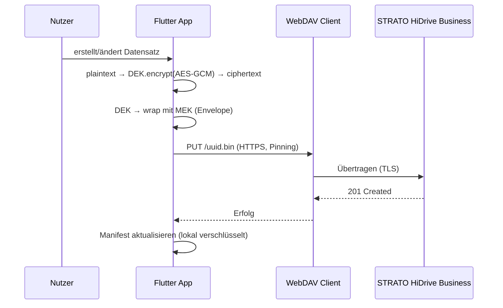
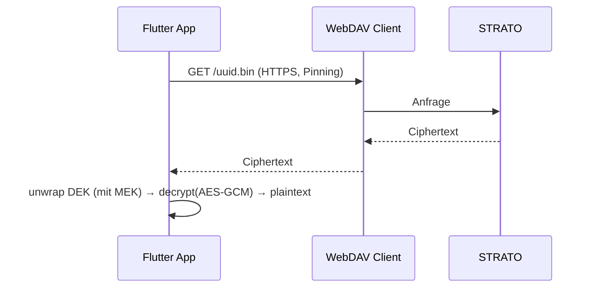

# Architektur – App ↔ STRATO HiDrive Business (E2E + Defense‑in‑Depth)

Diese Skizze zeigt, wie deine Flutter‑App mit **STRATO HiDrive Business (E2E)** integriert wird – inklusive **app‑interner Verschlüsselung** (AES‑GCM, MEK/DEK) und **UUID/Manifest** zur Metadaten‑Härtung.

---

## 1) Komponentenübersicht (Mermaid)
```mermaid
flowchart LR
  A[Flutter App\n(MEK in Secure Storage)] -->|Encrypt (DEK/AES-GCM)\nUUID-Dateiname| B[WebDAV Client]
  B -->|HTTPS + Pinning| C[STRATO HiDrive Business\n(E2E verschlüsselte Ablage)]
  subgraph App
    A
    B
  end
  subgraph STRATO
    C
  end
```

**Prinzip:**
1) **App-intern** werden Inhalte mit **DEK** verschlüsselt, der **DEK** wird mit **MEK** (Secure Storage) „gewrappt“ (Envelope).  
2) Upload erfolgt über **WebDAV/HTTPS mit Zertifikats‑Pinning** zu HiDrive Business.  
3) **Dateinamen = UUIDs**, menschenlesbare Metadaten verbleiben **nur im lokalen, verschlüsselten Manifest**.

---

## 2) Sequenz – Upload (Verschlüsselte Datei)


---

## 3) Sequenz – Download (Lesen)


---

## 4) Datenformate
**Datei (Beispiel JSON‑Bundle):**
```json
{
  "v": 1,
  "alg": "AES-256-GCM",
  "nonce": "base64...",
  "aad": { "schema": "clients", "version": 1 },
  "ciphertext": "base64...",
  "tag": "base64...",
  "dekWrapped": {
    "alg": "AES-256-GCM",
    "nonce": "base64...",
    "ciphertext": "base64...",
    "tag": "base64..."
  }
}
```

**Manifest (lokal, verschlüsselt, nicht hochgeladen):**
```json
{
  "v": 1,
  "entries": [
    { "uuid": "6f0c...", "schema": "clients", "title": "M. Schmidt", "updatedAt": "2025-09-16T10:21:00Z" }
  ]
}
```

---

## 5) Sicherheitsschichten
- **App‑intern:** AES‑GCM, MEK (Secure Storage), DEK pro Objekt (Envelope), AAD‑Kontext.  
- **Transport:** HTTPS **mit Zertifikats‑Pinning** (SPKI‑Hash).  
- **Speicher:** STRATO HiDrive **E2E** + Rechenzentrum **in DE**; Versionierung/Retention optional.  
- **Metadatenhärtung:** UUID‑Namen; sensible Titel nur lokal im verschlüsselten Manifest.  
- **Client‑Hardening:** FLAG_SECURE (Android), iOS‑Blur, Root/JB‑Block, App‑Lock.

---

## 6) Checkliste für die Umsetzung
- [ ] **AVV** mit STRATO abgeschlossen, PDF im Projekt abgelegt
- [ ] HiDrive **Business** aktiviert, **E2E** eingeschaltet (testen!)
- [ ] **Pinning** konfiguriert (mind. 2 Pins für Rotation)
- [ ] **Envelope‑Encryption** implementiert (MEK/DEK)
- [ ] **UUID‑Namen** & verschlüsseltes **Manifest** lokal
- [ ] **Lösch-/Retention‑Policy** in HiDrive gesetzt (z. B. Versionen 90 Tage)
- [ ] **DSFA** aktualisiert („HiDrive Business, DE, E2E aktiv“)

---

## 7) DSFA‑Baustein (zum Kopieren)
> Speicherung sensibler Inhalte erfolgt **zweistufig verschlüsselt**: (1) **Client‑seitig** mit AES‑256‑GCM (DEK je Datensatz, Wrapped mit MEK im Secure Storage), (2) **HiDrive Business E2E** beim Auftragsverarbeiter STRATO (Rechenzentrum Deutschland). **Dateinamen sind UUIDs**, menschenlesbare Metadaten verbleiben ausschließlich im **lokalen, verschlüsselten Manifest**. Transport erfolgt ausschließlich über **HTTPS mit Zertifikats‑Pinning**. Lösch- und Aufbewahrungsfristen werden über HiDrive‑Retention und Anwendungslogik durchgesetzt.

---

## 8) Migrationshinweis
- Beim ersten Start nach Aktivierung:
  - Bestehende Klartext‑Dateien: **lesen → verschlüsselt neu speichern → Klartext löschen**.  
  - Manifest erzeugen und alle Uploads in UUIDs umbenennen.  
  - Fortschritt protokollieren (ohne Inhalte), bei Abbruch fortsetzen.

---

## 9) Optional: Container‑Variante
- Statt einzelner Dateien: monatliche **Container (TAR) + Gesamtverschlüsselung** → weniger WebDAV‑Roundtrips, keine Metadaten nach außen.  
- Schlüsselverwaltung identisch (DEK/MEK), Index lokal.

