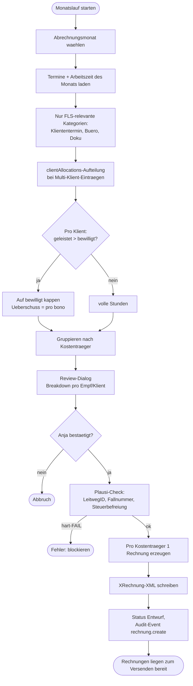

# Fachleistungsstunden (FLS) und Abrechnung

Die Fachleistungsstunden-Verwaltung ist das Herzstueck der Rechnungsstellung
in der Eingliederungshilfe. FEGH-Dokumentation sorgt dafuer, dass die
Abrechnung gegenueber dem Sozialamt rechtssicher und mit vollstaendigen
Pflichtangaben erfolgt.

## Funktionsweise im Detail

### Das Problem, das wir loesen

Die Eingliederungshilfe nach SGB IX wird nicht pauschal gezahlt,
sondern **leistungsbezogen**. Jeder Klient hat einen Bewilligungs-
bescheid mit einer Stunden-Obergrenze (z. B. "160 FLS pro Monat"),
und der Leistungserbringer rechnet nur die **tatsaechlich geleisteten,
abrechenbaren Stunden** ab. Das klingt einfach — ist es in der
Praxis nicht, weil:

- Nicht jede Taetigkeit zaehlt (Supervision zaehlt nicht, Teamsitzung
  nicht, Fortbildung nicht — beides ist bereits im Stundensatz
  eingepreist).
- Indirekte Taetigkeiten mit Fallbezug (Dokumentation, Buero) zaehlen
  nur anteilig — je nach Aufteilung auf mehrere Klienten.
- Jeder Kostentraeger hat einen **eigenen vereinbarten Stundensatz**
  (§125 SGB IX) — nicht einfach ein App-Default.
- Budget-Ueberschreitung geht zu Lasten der Einrichtung — der
  Traeger zahlt nicht mehr als bewilligt.
- Die Rechnung muss elektronisch nach **XRechnung-3.0.2-Spezifikation**
  erstellt und via OZG-RE eingereicht werden (§14a UStG / ERechVBln).

FEGH buendelt diese Logik: Termine erfassen → Budget pruefen →
automatisch aggregieren → Plausi-Check → XRechnung-XML → Abschicken.

### Konkretes Szenario: Ein Monatslauf fuer drei Klienten

**Einrichtung:** Assistenz gGmbH, Berlin. Vereinbarte Stundensaetze
mit dem Sozialamt Friedrichshain-Kreuzberg: 52,00 EUR je FLS fuer
ambulant betreutes Wohnen.

Drei Klienten bei diesem Traeger:

| Klient | Bewilligt (Monat) | Geleistet (Maerz) | Davon abrechenbar |
|--------|------|------|------|
| Frau A. | 12 h | 11,5 h | 11,5 h |
| Herr B. | 24 h | 28,5 h | 24 h (Kappung) |
| Frau C. | 8 h | 7,2 h | 7,2 h |

**01. April, 08:00 Uhr — Teamleitung Lina startet den Monatslauf.**

1. `Berichte → Rechnungen → Monatslauf`
2. Dialog fragt: "Abrechnungsmonat?" → Lina waehlt **Maerz 2026**
3. FEGH aggregiert:
   - **Kliententermine** (Kategorie "Kliententermin"): direkte Zeit.
   - **Buero-Termine mit Fallbezug**: geteilt nach `clientAllocations`-
     Aufteilung. Hat Lina am 15. Maerz 2h "Dokumentation A+B+C"
     gebucht mit 50/30/20-Aufteilung, landen 1h bei A., 0.6h bei B.,
     0.4h bei C.
   - **Dokumentations-Termine**: analog.
4. Fuer Herrn B. wird auf das **Bewilligte gekappt** (er hat 4,5 h
   ueber Budget geleistet — die Einrichtung darf diese nicht
   abrechnen, die Stunden sind "pro bono" erbracht).
5. **Review-Dialog** zeigt:

   ```
   Sozialamt Friedrichshain-Kreuzberg
     Frau A.    11,5 × 52,00 =   598,00 EUR
     Herr B.    24,0 × 52,00 = 1.248,00 EUR  (gekappt von 28,5 h)
     Frau C.     7,2 × 52,00 =   374,40 EUR
                                —————————
                                2.220,40 EUR  netto (§4 Nr. 16h)
   ```

6. Lina bestaetigt → System erzeugt **eine** Rechnung
   (`2026-04-001`) mit drei Positionen, pro Position:
   - `bezeichnung` = "Fachleistungsstunde Eingliederungshilfe"
   - `fallnummer` = Aktenzeichen des jeweiligen Klienten beim
     Sozialamt (aus `client.kostentraegerFallnummern`)
   - `clientGeburtsdatum` als DSGVO-konforme Identifikation
   - `leistungstyp` = "B5.01 ABW Erwachsene" (aus Klient-Stammdaten)
   - `bewilligungsRef` = Bewilligungsbescheid-Geschaeftszeichen

**10:15 Uhr — Plausi-Check laeuft.**

Das System prueft vor dem Speichern:

- **Hart**: Leitweg-ID des Empfaengers gueltig (991-01234-44)? Ja.
  Alle drei Klienten haben Fallnummern beim Sozialamt? Ja.
- **Weich**: Geburtsdatum bei Frau A. fehlt → Hinweis in gelb. Lina
  traegt es nach, Rechnung bleibt gueltig.

**10:20 Uhr — XRechnung-Export.**

Lina klickt `XML herunterladen`. Das System erzeugt eine **UBL-2.1-
konforme XML** mit:

- CustomizationID `urn:cen.eu:en16931:2017#compliant#urn:xeinkauf.de:kosit:xrechnung_3.0`
- BuyerReference = Leitweg-ID
- BG-4 Seller (FEGH gGmbH mit IBAN, USt-ID, Email, Telefon — alle
  BR-DE-Pflichtfelder gefuellt)
- BG-7 Buyer (Sozialamt Friedrichshain-Kreuzberg)
- Drei InvoiceLines mit Fallnummern als `cbc:Description`

Die Datei ist **signaturefrei** (OZG-RE validiert via eigenem Check)
und kann direkt unter <https://xrechnung.bund.de> eingereicht werden.

**10:25 Uhr — Einreichung ueber OZG-RE.**

Lina laedt die `xml` hoch, OZG-RE validiert gegen KoSIT-Schematron,
erzeugt eine Eingangsbestaetigung, weist die Rechnung dem Sozialamt
zu. Status in FEGH: **Versendet**.

**14. April — Zahlungseingang.**

Kontoauszug zeigt 2.220,40 EUR mit Verwendungszweck
"Rechnung 2026-04-001". Lina setzt Status auf **Bezahlt**, FEGH
schreibt Audit-Event `rechnung.status` mit alt=versendet / neu=bezahlt.

### Was bei Fehler passiert (Storno-Fall)

Kommt eine Rechnung zurueck ("Klient Frau A. war im Maerz nicht
betreut, Bewilligung pausierte wegen Krankenhaus"), erzeugt Lina
einen Storno:

1. `Kontextmenue → Stornieren` → neuer Datensatz `2026-04-001-ST`
   mit identischen Positionen, **negativen Mengen** (-11,5 × 52,00).
2. Bemerkung wird automatisch gesetzt: "Storno zu 2026-04-001"
3. Original wird auf Status "Storniert" geschaltet.
4. Ein Audit-Event `rechnung.storno` mit beiden IDs.
5. Neue korrekte Rechnung (`2026-04-002`) wird manuell neu erstellt.

Diese Art der Korrektur — Storno + Neuausstellung — ist
GoBD-konform (§146 Abs. 4 AO). Direkt-Editieren versendeter
Rechnungen ist verboten.

### Der Monatslauf als Flowchart



<!-- SCREENSHOT: Monatslauf-Review-Dialog mit Breakdown-Tabelle -->
<!-- SCREENSHOT: Plausi-Check-Ergebnis mit gruenen und roten Markierungen -->

### Das FLS-Budget-Gewissen

Beim Eintragen eines Termins prueft das System **sofort** den
aktuellen Verbrauch im Abrechnungszeitraum:

| Verbrauch | Warnung |
|-----------|---------|
| < 90 % | keine |
| 90-99 % | gelb "Budget nahezu erreicht — 14,4 von 16 FLS im April gebucht" |
| ≥ 100 % | rot "Bewilligtes Kontingent ueberschritten — Fortschreibung beantragen?" |

Der Mitarbeiter kann den Termin **trotzdem speichern** (Klienten-
kontakt darf nicht verweigert werden, nur weil Budget knapp ist),
aber die Organisation traegt das finanzielle Risiko.

### Abrechnungs-Kategorien: Was zaehlt, was nicht

Die App kategorisiert alle Termine/Arbeitszeiten. Nur bestimmte
Kategorien fliessen in FLS-Rechnungen ein:

| Kategorie | FLS-relevant | Begruendung |
|-----------|--------------|-------------|
| Kliententermin | ja | direkter Klientenkontakt |
| Buero (mit Fallbezug) | ja | indirekte Zeit am Fall |
| Dokumentation | ja | Fallarbeit |
| Supervision | nein | im Stundensatz eingepreist |
| Teamsitzung | nein | Organisationsgemeinkosten |
| Fortbildung | nein | Ausbildungskosten |
| Fahrtzeit | nein (Berlin) | eingepreist im BRV |

Fahrtzeit ist bundeslaenderspezifisch — in anderen Rahmenvertraegen
separat abrechenbar. Die Logik ist im `BundeslandProfil` kodiert
(Feld `fahrtzeitAbrechenbar: bool`).

### Rechtlicher Hintergrund kurz zusammengefasst

- **§113 SGB IX** — Leistungen zur sozialen Teilhabe, rechtliche
  Basis fuer ambulant betreutes Wohnen.
- **§125 SGB IX** — Verguetungsvereinbarung zwischen Traeger und
  Leistungserbringer (enthaelt Stundensatz, Intervall, Sonderregeln).
- **§14a UStG + ERechVBln** — Pflicht zur elektronischen Rechnung an
  Behoerden mit Leitweg-ID seit 27.11.2020 (Bundesbehoerden) /
  18.04.2020 (Berlin).
- **§4 UStG Nr. 16/18/25** — Steuerbefreiung fuer EGH/Wohlfahrt/
  Jugendhilfe. XRechnung verlangt einen VATEX-Code pro Ausnahme.
- **§146 Abs. 4 AO + GoBD** — Aenderungen buchhalterischer Daten
  muessen nachvollziehbar bleiben. Deshalb Storno + Neu statt
  Direkt-Edit.
- **HGB §257 + AO §147** — Aufbewahrungsfrist 10 Jahre fuer
  Rechnungen.

## Was ist eine Fachleistungsstunde?

Die FLS ist die **Brutto-Abrechnungseinheit** der Eingliederungshilfe.
Sie umfasst in Berlin (BRV) und in den meisten Landesrahmenvertraegen:

- Klient-Kontakt (direkt)
- Vor- und Nachbereitung
- Dokumentation
- Kollegiale Fallberatung mit Fallbezug
- Ausfallzeiten (Urlaub, Krankheit, Fortbildung) - eingepreist
- Sachkosten (Buero, Telefon, Material) - eingepreist
- Fahrzeiten - je nach Landesrahmenvertrag eingepreist oder gesondert

Abgerechnet wird die **tatsaechlich erbrachte direkt zurechenbare FLS**
mit dem **vereinbarten Stundensatz** aus der Verguetungsvereinbarung
nach §125 SGB IX.

## Kalkulationsfaktor

Der Kalkulationsfaktor (z.B. 1,33) ist **nur informativ** zur internen
Personalplanung. Er beschreibt das Verhaeltnis Gesamtarbeitszeit zur
abrechnungsfaehigen Kontaktzeit. Der Faktor ist **bereits im vereinbarten
Stundensatz eingepreist** - er darf nicht zusaetzlich auf die Rechnung
angewendet werden!

!!! warning "Doppelberechnung vermeiden"
    Wenn die Kalkulationsfaktor noch einmal auf die Rechnungs-Betraege
    angewendet wird (verbraucht x stundensatz x faktor), entsteht
    eine Doppelabrechnung. Das fuehrt zu Regressforderungen und kann
    bei Wiederholung als Betrug gewertet werden.

In FEGH-Dokumentation wird der Faktor nur fuer die Kennzahl
"Gesamtarbeitszeit (mit KLE)" in der Klienten-Detailansicht genutzt.

## Bewilligungsumfang und Intervall

Pro Klient werden in den Stammdaten erfasst:
- **Fachleistungsstunden** (bewilligt, aus Kostenuebernahme)
- **Fachleistungsintervall**: woechentlich / monatlich / jaehrlich

Wird ein Klient mit 10 FLS/Woche bewilligt, berechnet FEGH den Verbrauch
**ausschliesslich im aktuellen Wochenzeitraum** (Montag 00:00 - Sonntag 23:59).
Ueberlaufende Termine in der Folgewoche werden dem neuen Zeitraum zugerechnet.

## Budget-Warnung

Beim Speichern eines Termins prueft FEGH automatisch den FLS-Verbrauch
im aktuellen Abrechnungszeitraum:

- **>= 90 %**: gelber Warndialog "Budget nahezu erreicht"
- **>= 100 %**: roter Warndialog "Bewilligtes Kontingent ueberschritten"

Der Nutzer kann jeweils abbrechen oder trotzdem speichern. Bei
Ueberschreitung ohne Fortschreibung des Bewilligungsbescheids traegt
das Risiko vollstaendig der Leistungserbringer - der Kostentraeger
kuerzt auf das bewilligte Mass.

## Abrechenbare vs. nicht abrechenbare TerminArten

| TerminArt | In Rechnung? |
|-----------|-------------|
| Kliententermin | ja |
| Buero (mit Fallbezug) | ja |
| Dokumentation | ja |
| Supervision | nein (im Stundensatz eingepreist) |
| Teamsitzung | nein |
| Fortbildung | nein |
| Fahrtzeit | nein (Berlin: eingepreist) |
| Sonstige | nein |

Die Rechnungs-Aggregation nutzt nur abrechenbare Termine. Supervision
und Fortbildung werden dokumentiert, erscheinen aber nicht auf der
Rechnung.

## Rechnungsstellung Schritt fuer Schritt

### 1. Empfaenger pflegen

Berichte > Rechnungen > Button **Empfaenger**.

Pflichtfelder pro Kostentraeger:
- Name (Bezirksamt / Behoerde)
- **Leitweg-ID** (format NNNNN-xxxxxxxxxxx-NN, erforderlich fuer
  XRechnung nach §14a UStG / ERechVBln)
- Strasse, PLZ, Ort

Optional: Abteilung, Ansprechpartner, E-Mail, Telefon, USt-ID.

### 2. Klient-Stammdaten pflegen

Pro Klient, der beim Kostentraeger abgerechnet wird:
- **Aktenzeichen / Fallnummer** (pro Kostentraeger eindeutig)
- **Bewilligungsbescheid-Referenz** (Geschaeftszeichen)
- **Leistungstyp-Schluessel** nach Rahmenvertrag (z.B. "B5.01 ABW Erwachsene")
- **Stundensatz** (individuell aus §125-Vereinbarung; NICHT den App-Default nutzen!)

### 3. Rechnung erstellen

Berichte > Rechnungen > FAB **Neue Rechnung**.

- Leistungszeitraum waehlen (meist Kalendermonat)
- Empfaenger waehlen (z.B. Sozialamt Friedrichshain-Kreuzberg)
- Bestellnummer / Aktenzeichen fuer diese Rechnung (optional)
- Bemerkung (optional, z.B. "Abrechnung Maerz 2026")

FEGH aggregiert automatisch alle abrechenbaren Termine im Zeitraum pro
Klient, rechnet Stunden zusammen und ermittelt den Einzelpreis aus
`client.stundensatzOverride` oder den App-Settings.

### 4. Plausi-Check

Vor dem Speichern prueft FEGH:

**Hart (blockierend):**
- Leitweg-ID des Empfaengers formal gueltig
- Aktenzeichen pro Klient beim aktuellen Kostentraeger vorhanden

**Weich (Hinweis):**
- Geburtsdatum der Klienten
- Leistungstyp-Schluessel
- Bewilligungsbescheid-Referenz
- Budget-Ueberschreitung im aktuellen Zeitraum

Der Nutzer kann bei weichen Warnungen trotzdem weitermachen,
harte Fehler sollten vor Erstellung behoben werden.

### 5. XRechnung-XML exportieren

In der Rechnungsliste: **XML herunterladen**. FEGH erzeugt UBL-2.1-XML
nach XRechnung-3.0-Spezifikation mit:

- Leitweg-ID als BuyerReference
- Steuerbefreiungsgrund nach §4 UStG (waehlbar zwischen Nr. 16 h / 25 / 18)
- Einrichtungs-IK (wenn konfiguriert)
- Pro Position: Aktenzeichen, Geburtsdatum, Leistungstyp, Bewilligungs-Ref
- IBAN / BIC / Kontoinhaber aus Rechnungssteller-Daten

### 6. Einreichung bei der Behoerde

Nach dem Export zeigt FEGH die Einreichungsoptionen:

1. **OZG-RE** (https://xrechnung.bund.de) - zentrale Rechnungsplattform
2. **PEPPOL-Netzwerk** (falls Ihr System angebunden ist)
3. **DE-Mail / beA** als Fallback-Weg (weniger bevorzugt)

### 7. Statusverfolgung

Pro Rechnung: Entwurf -> Versendet -> Bezahlt.

- **Versendet**: Nach Einreichung markieren (Kontextmenue)
- **Bezahlt**: Nach Zahlungseingang markieren
- **Storniert**: Storno-Rechnung erzeugen (siehe unten)

## Monatslauf (Automatik)

Fuer wiederkehrende Monatsabrechnungen: Berichte > Rechnungen > FAB
**Monatslauf** (teal-farbig, oberer FAB).

FEGH erzeugt in einem Durchgang pro Kostentraeger eine Rechnung fuer den
**letzten abgeschlossenen Kalendermonat** und verwendet dabei:

- Nur Klienten mit hinterlegter Fallnummer beim jeweiligen Empfaenger
- Nur abrechenbare TerminArten (siehe Tabelle oben)
- Indirekte Dokumentations-/Buero-Termine mit Fallbezug aus der
  `clientAllocations`-Aufteilung
- Stundensatz pro Klient (individuell oder Default)

Vor dem Speichern zeigt FEGH einen **Review-Dialog** mit Breakdown pro
Empfaenger, Klient, Stunden und Betrag. Der Nutzer bestaetigt oder bricht
ab. Jede erzeugte Rechnung wird im Audit-Log erfasst.

Empfehlung: Monatslauf am 1. des Folgemonats ausfuehren, Rechnungen
anschliessend pruefen und per XRechnung / OZG-RE einreichen.

## Audit-Log

Alle abrechnungsrelevanten Aktionen werden verschluesselt im DSGVO-Audit-Log
persistiert:

| Aktion | Kontext |
|--------|---------|
| `rechnung.create` | Rechnungsnr., Bruttobetrag |
| `rechnung.status` | Rechnungsnr., alter/neuer Status |
| `rechnung.storno` | Original-Nr., Storno-Nr. |
| `rechnung.xml_export` | Rechnungsnr. |

Das Log dient der **Rechenschaftspflicht nach DSGVO Art. 5 Abs. 2** und
der Dokumentation fuer Wirtschaftspruefungen / Betriebspruefungen.
Aufbewahrung: 3 Jahre (automatische Rotation), Rechnungsdaten selbst
10 Jahre nach HGB/AO.

## Storno-Rechnung

Bei Fehler oder Rueckgabe einer bereits versendeten Rechnung:
Kontextmenue > **Stornieren**.

FEGH erzeugt eine neue Rechnung mit:
- Negativen Mengen (die Betraege werden also negativ)
- Neuer Rechnungsnummer mit `-ST`-Suffix
- Bemerkung "Storno zu Rechnung X"
- Verweis auf Original via `stornoFuerRechnungId`

Die Original-Rechnung wird automatisch auf "Storniert" gesetzt.

## Steuerbefreiung

Die App erzeugt Rechnungen als **steuerfrei** (§4 UStG). Waehlbar ist:

| Option | Anwendungsfall |
|--------|----------------|
| §4 Nr. 16 h UStG | EGH durch anerkannten Traeger (Standard) |
| §4 Nr. 25 UStG | Jugendhilfe (SGB VIII) |
| §4 Nr. 18 UStG | Freie Wohlfahrtspflege |

Der korrekte Paragraph haengt vom Leistungstyp und der Anerkennung
des Leistungserbringers ab. Im Zweifel den Steuerberater fragen.

## Aufbewahrungsfristen

Rechnungsunterlagen muessen nach HGB §257 und AO §147 **10 Jahre**
aufbewahrt werden. FEGH speichert alle Rechnungen verschluesselt und
haelt sie ueber Backup/Restore-Funktion auch ueber App-Deinstallation
hinaus.

## Checkliste: Rechtssicher abrechnen

- [x] Verguetungsvereinbarung nach §125 SGB IX aktuell
- [x] Stundensatz aus Vereinbarung pro Klient (oder Default) gepflegt
- [x] Empfaenger mit korrekter Leitweg-ID angelegt
- [x] Aktenzeichen pro Klient beim Kostentraeger hinterlegt
- [x] Leistungstyp-Schluessel gemaess Rahmenvertrag gesetzt
- [x] Bewilligungsbescheid-Referenz dokumentiert
- [x] Bewilligtes Kontingent (FLS + Intervall) aktuell
- [x] XRechnung-Export ueber OZG-RE einreichen
- [x] Status pflegen (Versendet / Bezahlt / Storniert)
