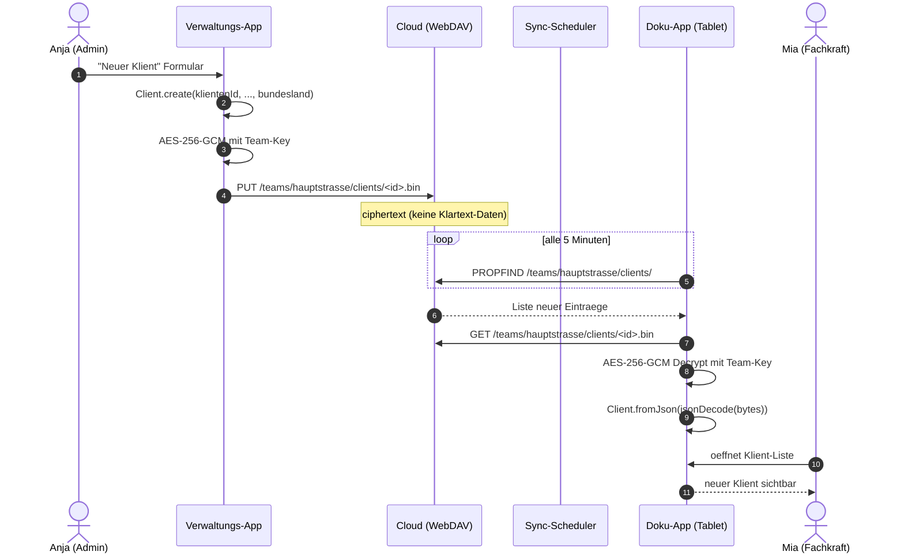

# Klienten verwalten

## Uebersicht

Der Klienten-Tab zeigt alle Klienten als durchsuchbare Liste mit Filteroptionen. Klienten sind farbkodiert und koennen nach verschiedenen Kriterien sortiert werden.

## Funktionsweise im Detail

### Das Problem, das wir loesen

Eingliederungshilfe (EGH) ist kein einheitliches Leistungsfeld. Jeder
Klient bringt eine eigene Kombination aus:

- **Rechtsgrundlage** (SGB IX Teil 2 fuer EGH, SGB VIII fuer Jugendhilfe,
  SGB XI fuer Pflege, SGB XII fuer Sozialhilfe)
- **Kostentraeger** (Bezirk, Land, Kommune — je nach Bundesland
  unterschiedlich zugeschnitten)
- **Bedarfsinstrument** (TIB in Berlin, BEI_NRW in NRW, ITP in Rheinland-
  Pfalz/Thueringen, HMBV in Hamburg, usw. — 11 aktive Instrumente)
- **Leistungsart** (ambulant betreutes Wohnen, Assistenzleistungen,
  Fachleistungsstunden, Tagesstruktur)
- **Ziel-Framework** (TIB-Ziele, ICF-Bereiche, individuelle
  Zieldefinitionen)

Ohne digitale Klienten-Akte muessten Betreuer diese Informationen aus
fuenf verschiedenen Ordnern zusammensuchen. Die Klienten-Verwaltung
buendelt das in einen einzigen Datensatz und macht ihn team- und
geraete-uebergreifend verfuegbar — mit der richtigen Abrechnungslogik
gleich mit eingebaut.

### Konkretes Szenario: Herr M. zieht nach Koeln

Herr M. war bislang in Berlin in einem ambulanten Wohnprojekt mit
TIB-basiertem Bedarfsplan. Er zieht nach Nordrhein-Westfalen in eine
neue Einrichtung. Sein neuer Bezirk ist das Sozialamt Koeln, das nach
**BEI_NRW** arbeitet — einem komplett anderen Bedarfsinstrument. Was
die App fuer Herrn M. leistet:

**01. April, 10:00 Uhr — Admin Anja legt den Klienten an.**

1. Tab "Klienten" → **Neuer Klient**
2. Stammdaten: Name, Geburtsdatum, Adresse, Notfallkontakt
3. Im Feld "Bundesland-Override" waehlt sie **Nordrhein-Westfalen**
   (weicht vom Organisations-Bundesland ab, weil ihre Einrichtung
   bundeslaenderuebergreifend arbeitet).
4. Bedarfsinstrument wird automatisch auf **BEI_NRW** gesetzt —
   abgeleitet aus dem Bundesland-Profil.
5. Kostenuebernahme: Sozialamt Koeln, Zeitraum 01.04.2026 - 31.03.2027,
   **160 Fachleistungsstunden pro Monat** bewilligt.
6. **Fallnummer pro Kostentraeger**: "Koeln Sozialamt" → "EGH-2026-K-4712"
7. **TIB-Ziele** aus Berlin werden optional uebernommen (Felder in der
   App); da Koeln BEI_NRW nutzt, werden parallel die BEI-Items
   klassifiziert.
8. **Rechtsgrundlage**: `§113 SGB IX` (Leistungen zur sozialen
   Teilhabe) wird als Standard vorgeschlagen.

**Was im Hintergrund passiert:** Der `Client.create()`-Factory erzeugt
eine Instanz im gemeinsamen `fegh_core`-Datenmodell. Sie enthaelt
sowohl die klassischen Doku-Felder (vorname/nachname/geburtsdatum)
als auch die Verwaltungs-Felder (klientenId, leistungstypSchluessel,
kostentraegerFallnummern). Beim naechsten Sync laden beide Apps
denselben JSON-Record und koennen ihn identisch darstellen.

### Datenfluss Verwaltung → Doku (Klient-Anlage)



<!-- SCREENSHOT: Klient-Formular Verwaltung mit Fallnummer-pro-Kostentraeger -->
<!-- SCREENSHOT: Klient-Detailansicht Doku-App mit FLS-Balken -->

### Bundesland-Override — warum?

Standardmaessig uebernimmt der Klient das Bundesland der Organisation
(aus den Einstellungen). Das funktioniert fuer ~90 % der Faelle.
Wann `bundeslandOverride` gesetzt wird:

- Klient zieht in ein anderes Bundesland, Einrichtung folgt ihm fuer
  eine Uebergangszeit
- Einrichtung ist bundeslaenderuebergreifend und pflegt Klienten aus
  mehreren Bundeslaendern unter einem Admin-Account
- Kostentraeger ist aus einem anderen Bundesland als die Einrichtung

Der `effektivesBundesland`-Getter waehlt Override vor
Organisationswert. Das Bundesland-Profil (`BundeslandProfil`) liefert
das passende Bedarfsinstrument, Rahmenvertrags-Hinweise und Formular-
spezifische Flags.

### Die Fallnummer-pro-Kostentraeger-Mechanik

Viele Klienten haben **parallele Akten** bei verschiedenen Traegern:

- Sozialamt Koeln: EGH-2026-K-4712
- Integrationsamt Regionalbezirk: IA-2026-0891
- Krankenkasse (Teilbudget): AOK-NORDWEST-87654321

Wenn die Verwaltung eine Rechnung an "Sozialamt Koeln" erzeugt, muss
auf **diesem** Beleg die Fallnummer `EGH-2026-K-4712` stehen — nicht
die der Krankenkasse. Das Feld `kostentraegerFallnummern` ist deshalb
eine Map, **nicht** ein einzelner String.

Im Rechnungslauf wird automatisch die Fallnummer zum aktuell adres-
sierten Kostentraeger eingesetzt (BT-10 LeitwegID, BT-13
PurchaseOrderReference oder als Free-Text je nach Abrechnungspfad).
Fehlt die Fallnummer fuer den aktiven Kostentraeger, nimmt das
System die generische Klienten-ID — was vom Traeger abgelehnt werden
kann und im Audit vermerkt wird.

### FLS-Kalkulation — Kalkulationsfaktor verstanden

Die Rechnung an den Sozialhilfetraeger wird nicht "1:1 geleistete
Stunden mal Stundensatz" abgerechnet. Ein Teil der Arbeit
(Dokumentation, Teamsitzung, Fahrzeit, Supervisionsanteile) ist
nicht direkt am Klienten, muss aber mitfinanziert werden.

Der **Kalkulationsfaktor** (Standard 1,33) bildet das ab:

```
Gesamtarbeitszeit = Verbraucht × Kalkulationsfaktor
                  = 120 h × 1,33
                  = 159,6 h

Abrechnungsbetrag = min(Verbraucht, Bewilligt) × Stundensatz
                  = min(120, 160) × 40 EUR
                  = 4.800 EUR
```

Konfigurierbar **pro Klient**, weil manche Traeger eigene Faktoren
verhandeln (z. B. 1,20 bei einem Rahmenvertrag, 1,45 bei
intensivbetreuten Faellen). Die Override-Felder
`kalkulationsfaktorOverride` und `stundensatzOverride` schlagen den
Einrichtungs-Default.

### Delegation: Vertreter 1 und Vertreter 2

Jeder Klient hat eine **Haupt-Betreuerin** (implizit via Team-Zuordnung)
und bis zu **zwei benannte Vertretungen**. Zweck:

- Bei Urlaub/Krankheit der Hauptbetreuung: Zustaendigkeitsanfragen gehen
  automatisch an Vertreter 1, bei dessen Ausfall an Vertreter 2.
- Im Dienstplan werden Vertreter beim Schichtkonflikt bevorzugt
  vorgeschlagen.
- In Notfallbenachrichtigungen sind Vertreter Fallback-Empfaenger.

Die Felder sind Mitarbeiter-IDs, keine Freitext-Namen — damit Team-
Wechsel die Verknuepfung automatisch updaten.

### ICF, TIB und individuelle Ziele

Das Zielframework ist gestuft:

- **ICF-Bereiche** (International Classification of Functioning):
  neun Oberkategorien, z. B. `d230 Taegliche Routine durchfuehren`.
  Dient der uebergeordneten Einordnung, Cross-Bundesland-kompatibel.
- **TIB-Ziele** (Teilhabeinstrument Berlin): konkrete Zielsaetze aus
  dem Berliner Katalog, z. B. `T-1.3 Geld verwalten lernen`.
- **Individuelle TIB-Ziele**: Freitext-Zielformulierungen, wenn das
  Standard-Katalog nicht passt.

Bei der Wirkungsmessung (separates Modul) wird pro Ziel ein
Fortschrittswert 0-100 gepflegt. Das speist die Dashboards, das
Monatsbericht-PDF und den Jahres-Teilhabebericht.

### Farbcodierung und Datenschutz

Die `customColor` hat zwei Zwecke: schnelle visuelle Unterscheidung
im Kalender und Dienstplan + Barriere gegen versehentliche
Fehlzuordnung ("Schicht Blau = Frau L., nicht Herr K."). Die Farbe
ist in keinem Sinne klinische Information — sie ist reine UX.

## Klient anlegen

!!! note "Berechtigung"
    Klienten anlegen koennen nur **Teamleitungen** und **Admins**. Mitarbeiter sehen den "Neuer Klient"-Button nicht.

Ein Klienten-Datensatz umfasst:

### Stammdaten

| Feld | Beschreibung |
|------|-------------|
| Name / Vorname / Nachname | Vollstaendiger Name des Klienten |
| Klienten-ID | Externe Identifikationsnummer |
| Geburtsdatum | Fuer Altersberechnung und Berichte |
| Betreuung seit | Beginn der Betreuung |

### Kostenuebernahme

| Feld | Beschreibung |
|------|-------------|
| Kostenuebernahme | Name des Kostentraegers |
| Kostenuebernahme von/bis | Gueltigkeitszeitraum |
| Fachleistungsstunden | Bewilligte Stunden |
| Fachleistungsintervall | Woechentlich, monatlich oder jaehrlich |
| Verbrauchte Stunden | Bereits geleistete Stunden |
| Bewilligungsbescheid-Referenz | Geschaeftszeichen des Sozialamts |
| Leistungstyp-Schluessel | Leistungstyp nach Rahmenvertrag (z.B. B5.01 ABW Erwachsene) |

### Fallnummer pro Kostentraeger

Ein Klient kann bei **mehreren Kostentraegern** mit unterschiedlichem
Aktenzeichen gefuehrt werden (z.B. Umzug zwischen Bezirken). Die
Fallnummer-Liste ordnet jedem Rechnungsempfaenger ein Aktenzeichen zu.

- **Empfaenger** (Dropdown): einer der in Berichte > Rechnungen > Empfaenger
  angelegten Kostentraeger
- **Fallnummer / Aktenzeichen**: eindeutig pro Kostentraeger

Beim Rechnungslauf wird automatisch die korrekte Fallnummer pro Klient
eingesetzt. Fehlt die Fallnummer fuer den aktuellen Kostentraeger, wird
als Fallback die Klienten-ID gesetzt (kann vom Sozialamt abgelehnt werden).

### FLS-Kalkulation (Fachleistungsstunden)

Fuer jeden Klienten wird automatisch berechnet:

- **Verfuegbare Stunden** = Bewilligte - Verbrauchte Stunden
- **Gesamtarbeitszeit** = Verbrauchte Stunden x Kalkulationsfaktor (Standard: 1,33)
- **Abrechnungsbetrag** = min(Verbraucht, Bewilligt) x Stundensatz (Standard: 40 EUR)

Der Kalkulationsfaktor und Stundensatz koennen pro Klient ueberschrieben werden (Felder `kalkulationsfaktorOverride` und `stundensatzOverride`).

### Ziele und Klassifikation

| Feld | Beschreibung |
|------|-------------|
| TIB-Ziele | Teilhabeziele nach Berliner Teilhabeinstrument |
| Individuelle TIB-Ziele | Eigene Zieldefinitionen |
| ICF-Bereiche | Klassifikation nach ICF-Standard |
| Rechtsgrundlage | Rechtliche Basis der Leistung |
| Hilfe-Typ | Eingliederungshilfe oder Familienhilfe |

### Delegation

| Feld | Beschreibung |
|------|-------------|
| Vertreter 1 | Erste Vertretungsperson (Mitarbeiter-ID) |
| Vertreter 2 | Zweite Vertretungsperson (Mitarbeiter-ID) |

### Darstellung

Jeder Klient kann eine individuelle Farbe zugewiesen bekommen (`customColor` als Hex-Wert), die im Kalender und in Listen angezeigt wird. Es stehen 24 vordefinierte Farben zur Verfuegung.

## Klient bearbeiten

!!! note "Berechtigung"
    **Stammdaten** aendern koennen nur Teamleitungen und Admins. **Dokumentation** (Termine, Berichte) kann jeder Mitarbeiter bearbeiten.

## Klient loeschen

!!! warning "Berechtigung"
    Klienten loeschen koennen nur **Admins**. Die Loeschung ist unwiderruflich.

## Klient einem Team zuweisen

Admins koennen Klienten ueber den Verwaltung-Tab einem bestimmten Team zuweisen. Die Klientendaten werden verschluesselt im Team-Verzeichnis des Cloud-Speichers abgelegt (HiDrive, Nextcloud, ownCloud oder generischer WebDAV — abhaengig von der Organisations-Einstellung).
