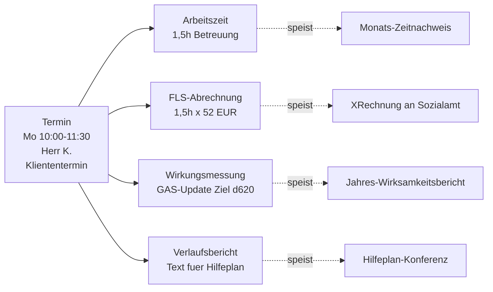

# Termine und Kalender

## Funktionsweise im Detail

### Das Problem, das wir loesen

Ein Termin in der Eingliederungshilfe ist kein reines Kalender-
eintrag. Er traegt **vier unterschiedliche Bedeutungen** gleichzeitig:

1. **Geplante Leistung** gegenueber dem Klient (Hilfeplan-Umsetzung)
2. **Abrechnungsgrundlage** gegenueber dem Kostentraeger (FLS-Stunde)
3. **Dokumentationspflicht** im Sinne der Wirksamkeitsmessung
   (was wurde gearbeitet, an welchem Ziel)
4. **Teamorganisation** (Wer ist wann bei welchem Klienten — Schicht,
   Vertretungsregel, Ausfall)

Wuerde ein Termin nur in einem Kalender-Programm stehen, gingen
Punkte 2-4 verloren. Der FEGH-Termin verbindet alle vier: Er
startet als Kalenderkarte, liefert im Anschluss Arbeitszeit (falls
stattgefunden), erzeugt die Abrechnungsgrundlage und verknuepft sich
mit dem Teilhabeziel, zu dem er beigetragen hat.

### Konkretes Szenario: Woche von Mitarbeiterin Mia

**Montag 10:00-11:30** — Regelmaessige Begleitung Herr K. bei Einkauf
(Teilhabeziel: "eigenstaendiges Einkaufen wiedererlernen").

Mia legt den Termin an:

- Klient: Herr K.
- Datum: Mo 10:00-11:30
- Art: Kliententermin (FLS-relevant)
- Ort: Supermarkt Alexanderplatz
- Verknuepftes Ziel: `ICF d620 - Gueter des taeglichen Bedarfs`

Montag 11:30 kehrt Mia zurueck. Sie markiert den Termin als
**stattgefunden** und traegt in den Verlaufsbericht ein:
"Kassenzone noch herausfordernd, naechstes Mal gezielt Kassenablauf
ueben." Der Termin fliesst jetzt automatisch:

- In die **FLS-Berechnung** (1,5 h × Stundensatz an das Sozialamt)
- In die **Wirkungsmessung** (naechste GAS-Messung wird um 1 hoch-
  gesetzt, weil Teilziel erreicht: "Herr K. waehlt Produkte
  selbststaendig")
- In den **Verlaufsbericht** (fuer Hilfeplan-Konferenz)
- In Mias **Arbeitszeit** (1,5 h `Betreuung`)

**Dienstag 14:00-15:00** — Mia ist krank. Sie markiert den Termin
als **abgesagt**, Grund: "Mitarbeiter krank". Vertreter 1 (Lars)
bekommt eine Benachrichtigung und uebernimmt bei akutem Bedarf;
ansonsten wird der Termin neu terminiert.

**Mittwoch 09:00** — Herr K. hat Zahnarzttermin. Mia legt einen
**Klientenabwesenheit** an (keine Leistung, wirkt als Information
fuers Team), kein FLS-relevanter Termin.

**Donnerstag 14:00-17:00** — Fallkonferenz fuer Frau L. mit
Sozialamt und Betreuer:

- Klient: Frau L.
- Art: **Buero mit Fallbezug** (FLS-relevant)
- Verknuepfung: Teilhabeplan-Konferenz

**Freitag 10:00** — Teamsitzung intern:

- Kein Klient
- Art: **Teamsitzung** (nicht FLS-relevant, aber Arbeitszeit)

Am Monatsende:

- FLS-Summe fuer Herrn K.: 1,5 h (Mo) + evtl. weitere Termine
- FLS-Summe fuer Frau L.: 3 h (Do) + …
- Termine Mias mit Verknuepfung zu Herrn K.s Zielen erscheinen im
  Wirksamkeitsbericht, wenn sie GAS-Messungen ausloesen.

### Ein Termin — vier Datenfluesse

<!-- SCREENSHOT: Termin-Formular mit Klient, Art, Ziel-Verknuepfung -->

### Wiederholungstermine und Serien

Regelmaessige Termine (z. B. jeden Montag 10-11:30) werden als
**Serie** angelegt:

- Muster waehlen: taeglich / woechentlich / monatlich / individuell
- Ausnahmen: einzelne Termine koennen aus der Serie gestrichen oder
  angepasst werden, ohne die ganze Serie zu beruehren
- Ende: konkretes Datum oder "bis auf Weiteres"
- Beim Loeschen wird gefragt: nur dieses Vorkommen, alle zukuenftigen,
  gesamte Serie

### Abrechnungs-Sicht der Termine

Die Termine sind die **Primaerquelle** der FLS-Abrechnung. Der
Monatslauf aggregiert alle Termine eines Zeitraums nach:

1. **Kostentraeger** des Klienten
2. **Klient**
3. **Abrechenbare Kategorien** (siehe Arbeitszeit-Taetigkeitstypen)

Ein Termin ohne Klient-Verknuepfung kann **nicht abgerechnet werden**
— deshalb warnt die App, wenn Kategorie = "Kliententermin" aber
kein Klient ausgewaehlt.

### Ueberlappungs-Handling

Ueberlappende Termine sind **manchmal legitim** (Doppelbesetzung
bei komplexen Faellen, Vertreter + Hauptbetreuer zusammen) und
**manchmal Fehler** (Mitarbeiter hat bei zwei Klienten gleichzeitig
eingetragen). Die App zeigt Ueberlappungen visuell (mehrspaltig
nebeneinander im Kalender) und warnt beim Speichern, blockt aber
nicht.

### Rechtlicher Hintergrund

- **§121 SGB IX** — Teilhabeplan als Grundlage; Termine
  implementieren die Teilhabeplan-Schritte.
- **§36b SGB IX** (neu seit BTHG) — Dokumentationspflichten im
  Rahmen der Gesamtplanung.
- **Art. 5 DSGVO** — Termine enthalten personenbezogene Daten
  (Klient + Mitarbeiter). Aufbewahrungsfrist 3 Jahre; nach Abschluss
  der Hilfe nur mit Einwilligung laenger.

## Kalenderansicht

Der Kalender zeigt Termine in einer **Wochen- oder Monatsansicht** mit folgenden Features:

- Farbkodierte Klienten (24 einzigartige Farben)
- Ueberlappende Termine mit mehrspaltiger Darstellung
- Praezise Zeitpositionierung (80px pro Stunde)
- Klienten-Farbelegende
- Animierter Seitenaufbau (Staggered Animations)

## Termin erstellen

Ein neuer Termin kann ueber den **"+"**-Button auf dem Dashboard oder im Kalender erstellt werden.

!!! note "Berechtigung"
    Termine erstellen koennen alle Mitarbeiter und Teamleitungen. Pruefer (Auditor) haben nur Lesezugriff.

### Termin-Felder

| Feld | Beschreibung |
|------|-------------|
| Klient | Zugeordneter Klient |
| Datum | Termin-Datum |
| Startzeit / Endzeit | Zeitraum des Termins |
| Termin-Art | Typ des Termins (siehe unten) |
| Notizen | Freitext-Dokumentation |
| Aufgezeichneter Text | Spracherkennung-Transkript (falls verfuegbar) |
| Berufsgruppe | Berufliche Zuordnung des Mitarbeiters |
| Eingliederung | Art der Eingliederung |

### Termin-Arten

| Art | Beschreibung |
|-----|-------------|
| Kliententermin | Direkte Arbeit mit dem Klienten |
| Buero | Bueroarbeit |
| Dokumentation | Dokumentationszeit |
| Supervision | Supervision |
| Teamsitzung | Teambesprechung |
| Fortbildung | Weiterbildung |
| Fahrtzeit | Fahrzeit (verknuepfbar mit Fahrweg-Datensatz) |
| Sonstige | Andere Taetigkeiten |

### Indirekte Termine

Bei indirekten Terminen (z.B. Buero, Teamsitzung) kann die Zeit auf mehrere Klienten aufgeteilt werden ueber das Feld `clientAllocations`.

### Zielverknuepfung

Termine koennen mit TIB-Zielen und ICF-Bereichen verknuepft werden. Fuer jedes Ziel kann eine Minutenzahl angegeben werden (`tibZielMinuten`), um die Zeitverteilung pro Ziel zu dokumentieren.

### Fahrwege

Hin- und Rueckfahrten koennen mit Fahrweg-Datensaetzen verknuepft werden (`fahrwegHinId`, `fahrwegRueckId`). Fahrwege erfassen:

- Start- und Zielstandort
- Distanz in Kilometern
- Verknuepfung mit Termin und Klient

Die Distanzberechnung kann optional ueber die **OpenRouteService API** automatisiert werden. Berechnete Distanzen werden gecacht.

## Termindetails

Ein Klick auf einen Termin oeffnet die Detailansicht mit allen Feldern und verknuepften Fahrwegen.

## Dokumentationsuebersicht

Der Tab "Dokumentation" zeigt alle Termine chronologisch mit Volltextsuche. Dokumentationen koennen kopiert und durchsucht werden.
